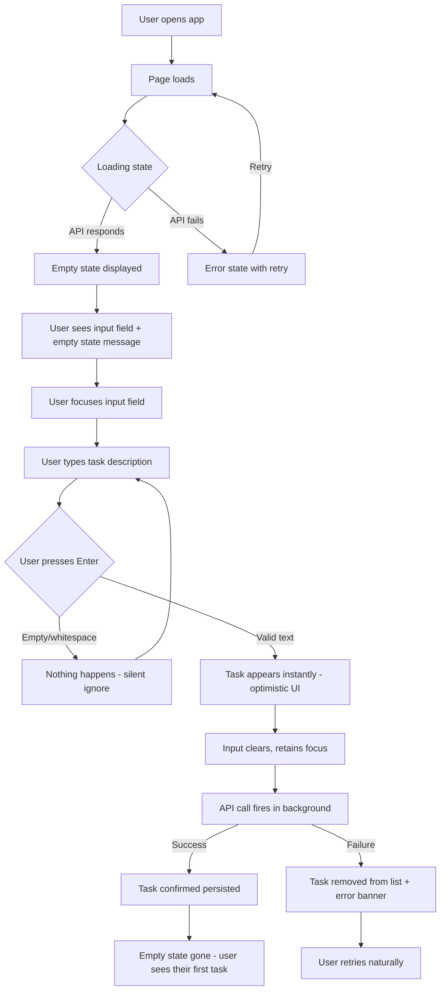
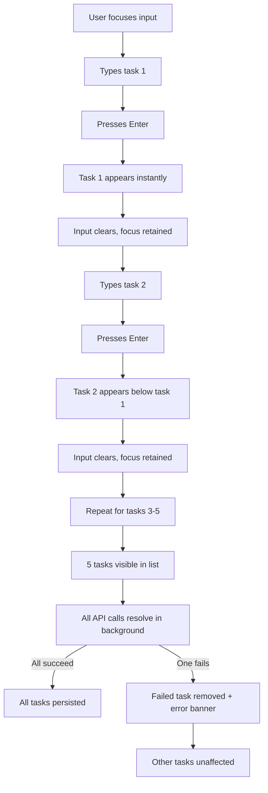
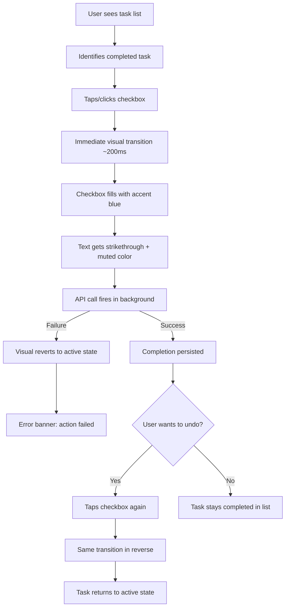
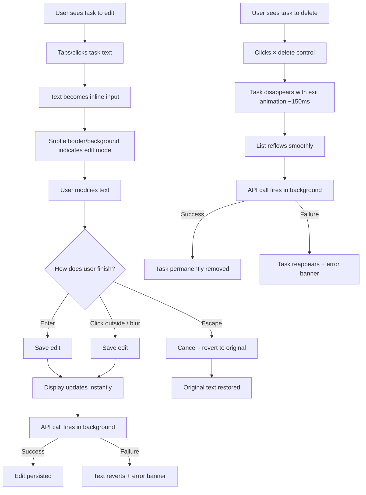
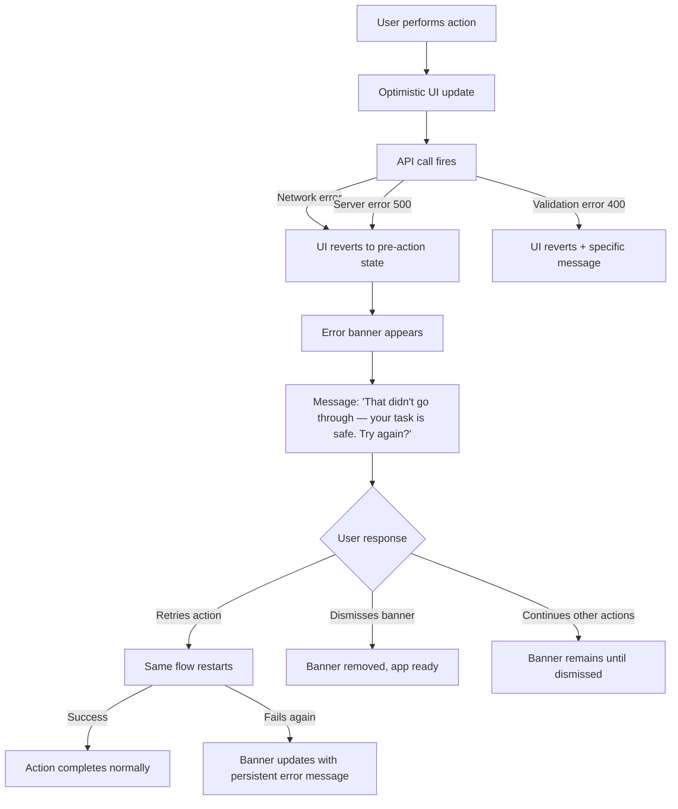

# UX Design Specification todo

**Author:** Marius
**Date:** 2026-03-04

---

<!-- UX design content will be appended sequentially through collaborative workflow steps -->

## Executive Summary

### Project Vision

A focused personal task management application that prioritizes simplicity and craft over feature richness. The core UX philosophy is that the best productivity tool is one you never have to fight with — zero onboarding, instant interactions, and absolute reliability. Every design decision serves one question: does this help the user add a task, finish a task, or get out of their way?

### Target Users

- **The Minimalist (Clara)** — Overwhelmed by feature-heavy tools. Needs zero-friction task capture, clear visual status, and an app that becomes invisible in daily use. Primary device: mobile + desktop.
- **The Student (Kai)** — Chaotic schedule, rapid task entry. Needs inline editing, reliable persistence, and graceful error recovery when conditions are imperfect (bad Wi-Fi, accidental tab closures).
- **The Developer (Priya)** — Judges quality by edge cases. Expects no layout shift, proper loading states, clean error handling, accessible markup, and responsive design at every breakpoint.

### Key Design Challenges

- **Instant-feeling interactions with error safety** — Optimistic UI must feel seamless while rollbacks on failure remain clear and non-disruptive
- **Simplicity without emptiness** — Minimal feature set must feel complete and intentional, not bare; empty states, micro-interactions, and polish carry outsized weight
- **Accessibility as first-class design** — Keyboard navigation, screen reader announcements for dynamic state changes, and focus management must be designed in from the start, not retrofitted

### Design Opportunities

- **Zero-onboarding first impression** — A well-crafted empty state with clear input prompt creates an immediate "aha" moment with no tutorial needed
- **Satisfying micro-interactions** — Few actions means each one (add, complete, delete) can receive tactile, responsive feedback that makes the app feel crafted
- **Trust through visible reliability** — Proper loading states, consistent error handling, and graceful edge cases become UX differentiators that earn user trust

## Core User Experience

### Defining Experience

The core experience is the **add-task → complete-task loop**. Everything in the application exists to serve this cycle: the user thinks of something to do, captures it instantly, and checks it off when done. The defining interaction is task creation — type a description, hit Enter, see it appear. If this feels instant and effortless, the product succeeds. If it doesn't, nothing else matters.

The secondary loop — edit, delete, toggle — supports task hygiene but should never compete with the primary flow for attention or screen real estate.

### Platform Strategy

- **Platform:** Responsive web SPA, no native apps for MVP
- **Input paradigm:** Mobile-first touch with full keyboard support on desktop
- **Breakpoints:** Mobile (< 768px), tablet (768px–1024px), desktop (> 1024px)
- **Browser targets:** Chrome, Firefox, Safari, Edge (latest two versions)
- **Offline:** Not required for MVP — single-user, always-connected assumption
- **Layout:** Single-column on mobile, centered content container on desktop — no sidebars, no navigation, one screen does everything

### Effortless Interactions

- **Adding a task** — Always-visible input field, type and Enter. No button clicks required, no modal dialogs, no category selection. The input is the interface.
- **Completing a task** — Single tap/click on the task or its checkbox. Immediate visual feedback (strikethrough, muted color). No confirmation dialog.
- **Deleting a task** — Single action, no multi-step confirmation for a lightweight item. Visual feedback on removal.
- **Editing a task** — Inline edit triggered by clicking/tapping the task text. No separate edit screen or modal. Edit in place, save on blur or Enter.
- **Viewing tasks** — Open the app, see your tasks. No login, no loading spinner that lasts more than a blink, no layout shift as content appears.

### Critical Success Moments

1. **First 5 seconds (Clara's "aha")** — User opens the app, sees an empty state with a clear prompt, types a task, hits Enter, and it appears. Zero confusion, zero onboarding. This is the moment that determines whether the user comes back.
2. **Next-day return (trust moment)** — User reopens the app and everything is exactly where they left it. Completed tasks still checked, active tasks still active. This earns the trust that turns a first visit into a daily habit.
3. **Error recovery (Kai's Wi-Fi drop)** — Something fails. The app shows a clear, calm error message identifying what happened and offering retry. Nothing is lost or corrupted. The user's confidence survives the failure.
4. **Edge case resilience (Priya's test)** — Empty input rejected gracefully. Long text wraps properly. Loading state shows without layout shift. The app handles every boundary condition without breaking character.

### Experience Principles

1. **Input is the interface** — The text input field is the most important element on screen. It should always be visible, always ready, and always the fastest path to action.
2. **Every action, one step** — No action in the core loop should require more than one deliberate interaction. Add = type + Enter. Complete = tap. Delete = tap. Edit = tap, type, Enter.
3. **Show, don't tell** — No tooltips, no onboarding tours, no help text beyond the empty state. The interface should be self-evident through layout, hierarchy, and affordance.
4. **Fail visibly, recover quietly** — When something goes wrong, tell the user clearly. When it recovers, do it without fanfare. Never leave the user wondering what happened.
5. **Respect the glance** — A user should be able to open the app and understand their task status in under 2 seconds. Visual hierarchy between active and completed tasks must be immediate and unambiguous.

## Desired Emotional Response

### Primary Emotional Goals

- **Calm** — The dominant emotional state throughout the entire experience. The app never raises the user's heart rate — no surprising modals, no confusing states, no urgency. Every interaction feels quiet, predictable, and under the user's control. The product earns trust by never demanding attention it doesn't deserve.
- **Accomplishment** — Completing a task should deliver a small but real moment of satisfaction. The visual transition from active to complete (strikethrough, muted color) is a micro-reward. Seeing a list with checked-off items should feel like visible proof of progress — not just data management, but a record of things done.
- **Reassurance** — When something goes wrong, the app's tone is warm and protective: "don't worry, nothing was lost." Error states should reduce anxiety, not increase it. The user should never feel punished for a network failure or an accidental action.

### Emotional Journey Mapping

| Stage                     | Desired Emotion               | Design Implication                                                              |
|---------------------------|-------------------------------|---------------------------------------------------------------------------------|
| First visit (empty state) | Welcomed, not overwhelmed     | Clean prompt, friendly empty state message, no clutter                          |
| First task created        | Small spark of accomplishment | Instant appearance, subtle animation confirms success                           |
| Daily use (core loop)     | Calm focus                    | Minimal interface, no distractions, predictable behavior                        |
| Completing a task         | Satisfaction, progress        | Visual distinction (strikethrough + muted), feels like checking off a real list |
| Error occurs              | Reassured, not alarmed        | Warm messaging, clear that nothing was lost, simple retry path                  |
| Next-day return           | Trust, continuity             | Everything exactly as left — no surprises, no resets                            |
| Editing/deleting          | Effortless control            | Inline, immediate, no confirmation barriers for routine actions                 |

### Micro-Emotions

**Prioritized emotional states:**

- **Confidence over confusion** — Every element has obvious purpose and behavior. The user never wonders "what does this do?" or "did that work?"
- **Trust over skepticism** — Data persistence is invisible but absolute. The user stops worrying about whether their tasks are saved because the app never gives them a reason to doubt.
- **Satisfaction over mere completion** — Checking off a task isn't just a state change, it's a small reward. The visual feedback makes the action feel meaningful.
- **Calm over anxiety** — Error states de-escalate rather than alarm. Loading states are brief and smooth rather than jarring.

**Emotions to actively avoid:**

- Frustration (from unexpected behavior or broken flows)
- Doubt (from unclear feedback or missing confirmation)
- Overwhelm (from too many options, visual noise, or information overload)
- Abandonment (from cryptic errors that leave users stranded)

### Design Implications

- **Calm** → Muted, restrained color palette. Generous whitespace. No competing visual elements. Smooth, subtle transitions rather than flashy animations. Typography that breathes.
- **Accomplishment** → Visible state change on task completion — strikethrough and color shift provide tactile feedback. Task count or progress indication gives a sense of "things done." The completed state should feel good to look at, not like visual clutter.
- **Reassurance** → Error messages use warm, human language ("That didn't go through — your task is safe. Try again?"). No technical jargon. No red alert styling — use softer warning tones. Always communicate what was preserved, not just what failed.

### Emotional Design Principles

1. **Calm is the baseline** — If any design choice raises the emotional temperature (urgent colors, disruptive animations, alarming language), it needs strong justification. Default to quiet.
2. **Reward the small wins** — Task completion is the product's core value delivery. The visual and interaction design for this moment should feel intentionally crafted — not flashy, but satisfying.
3. **Protect the user's confidence** — Every error state, edge case, and loading state should leave the user feeling that the app is on their side. Never blame the user. Always show what's safe.
4. **Predictability is comfort** — The same action should always produce the same result. Consistent patterns across add, edit, complete, and delete build the subconscious trust that makes calm possible.

## UX Patterns & Design Guidelines

### Adopted UX Patterns

**Input Patterns:**
- Always-visible input field as primary interface element — directly supports our "input is the interface" principle
- Submit on Enter with no button dependency — eliminates a step from the core loop

**Feedback Patterns:**
- Optimistic UI with graceful rollback — instant-feeling interactions with safe error recovery
- Micro-animation on state change (checkbox fill, strikethrough transition) — delivers accomplishment without being distracting
- Human-toned error messaging — supports our reassurance emotional goal

**Visual Hierarchy Patterns:**
- Clear binary state distinction: active vs. complete (strikethrough + muted color) — supports "respect the glance" principle
- Content-dominant layout with minimal chrome — keeps the focus on tasks, not interface
- Generous whitespace as a design element — reinforces calm emotional baseline

**Interaction Patterns:**
- Inline editing without modal interruption — supports "every action, one step"
- Keyboard-first with full touch parity — serves both desktop and mobile users without compromise

### Anti-Patterns to Avoid

- **Feature creep disguised as "helpful"** — Labels, tags, due dates, and priorities add friction for users who just want a simple list. We ship with CRUD and nothing else.
- **Notification pressure** — Badge counts and alert indicators create urgency. Our app should never create anxiety about unfinished tasks — calm is the baseline.
- **Complex empty states** — No upselling, no tutorial dumps. Our empty state should be a single friendly prompt and a visible input field. Nothing more.
- **Confirmation dialogs for routine actions** — "Are you sure you want to delete?" on a lightweight todo item adds friction without proportional safety. Single-action delete is better than a blocking dialog.
- **Visual overload on completion** — Confetti, celebrations, or gamification mechanics conflict with our calm emotional goal. Task completion should feel satisfying through visual distinction, not performance.

### Design Strategy

**Core principles to implement:**
- Always-visible input field as primary UI element
- Optimistic UI with rollback on failure
- Human-toned, reassuring error language
- Subtle completion animation/visual shift
- List items with clear visual weight and state distinction
- Single-screen app with minimal keyboard vocabulary (Tab, Enter, Escape)
- Near-zero UI chrome — content dominates, controls recede

**Explicitly avoid:**
- Any form of notification, badge, or urgency indicator
- Multi-step confirmations for routine actions
- Gamification or celebration mechanics on task completion
- Tutorial overlays, tooltips, or onboarding flows
- Feature suggestions or upgrade prompts in the interface

## Design System Foundation

### Design System Choice

**Tailwind CSS** — Utility-first CSS framework with custom component design.

No pre-built component library. The application's deliberately minimal scope (one input, one list, a few buttons) makes a component library overhead rather than advantage. Custom components built with Tailwind utilities give full control over the calm, content-dominant aesthetic while keeping the codebase small and focused.

### Rationale for Selection

- **Minimal UI, maximum control** — With only ~4 core components (input field, task item, error banner, empty state), building from scratch is faster than overriding a component library's opinions
- **Aesthetic alignment** — Our Apple Reminders-inspired "nearly zero chrome" goal requires pixel-level control over whitespace, typography, and color that utility classes provide directly
- **Responsive by design** — Tailwind's mobile-first responsive utilities map directly to our breakpoint strategy (< 768px, 768px–1024px, > 1024px)
- **Lightweight footprint** — Purged Tailwind CSS produces tiny stylesheets, supporting our NFR2 (FCP < 1.5s) and NFR3 (TTI < 2s) performance targets
- **Solo developer efficiency** — No learning curve for a component library API. Write markup with utility classes, iterate visually in the browser, ship fast
- **Accessibility ownership** — We build accessibility into our few components rather than depending on a library's implementation. Full control over ARIA attributes, focus management, and keyboard interactions

### Implementation Approach

**Component inventory (complete list):**

| Component   | Purpose                                            | Accessibility requirements                             |
|-------------|----------------------------------------------------|--------------------------------------------------------|
| TaskInput   | Always-visible text input for task creation        | Label, placeholder, Enter to submit, focus management  |
| TaskItem    | Single task row with checkbox, text, edit, delete  | Checkbox role, keyboard operable, screen reader status |
| TaskList    | Container for task items with empty/loading states | List role, live region for dynamic updates             |
| ErrorBanner | Dismissible error notification                     | Alert role, warm messaging, auto-focus on appearance   |
| EmptyState  | First-visit and zero-tasks messaging               | Descriptive text, visual prompt toward input           |

**Tailwind configuration:**
- Custom color palette aligned with calm emotional goals (muted tones, no high-saturation alerts)
- Custom spacing scale for generous whitespace
- Typography scale optimized for readability and breathing room
- Transition utilities for subtle micro-animations on task state changes

### Customization Strategy

**Design tokens to define:**
- **Colors:** Primary action, completed state (muted), active text, error tone (warm, not alarming), background, borders
- **Typography:** Single font family, size scale (body, input, empty state heading), line heights for readability
- **Spacing:** Consistent padding/margin scale emphasizing whitespace as a design element
- **Transitions:** Duration and easing for task appearance, completion animation, error banner entry/exit
- **Shadows/Borders:** Minimal — subtle separators between tasks, light input field border, no heavy elevation

**Accessibility tokens:**
- Minimum 4.5:1 contrast ratio enforced across all color pairings
- Focus ring styling: visible, high-contrast, consistent across all interactive elements
- Touch target minimum: 44x44px on mobile breakpoints

## Defining Core Experience

### Defining Experience

> "Type a thought, hit Enter, it's captured. Check it off, it's done."

The entire product distilled to one interaction loop: **capture → complete**. This is the Tinder-swipe of task management — the single motion that defines the product's value. Everything else (edit, delete, error recovery) exists in service of making this loop trustworthy and frictionless.

The defining experience is not a feature — it's a *feeling*: the feeling that your intention was captured the instant you expressed it, and that finishing something is as simple as acknowledging it's done.

### User Mental Model

Users bring the **physical checklist metaphor** — universally understood, requires zero education:

| Physical world     | Digital equivalent | User expectation                    |
|--------------------|--------------------|-------------------------------------|
| Write it down      | Type + Enter       | It exists immediately               |
| Check the box      | Tap/click checkbox | It's visibly done                   |
| Cross it out       | Delete action      | It's gone                           |
| Come back tomorrow | Reopen the app     | The list is exactly where I left it |

**Key mental model implications:**
- Tasks are **linear** — a flat list, not a hierarchy. Users think in lists, not trees.
- Completion is **binary** — done or not done. No partial states, no percentages.
- Order is **chronological by creation** — newest tasks feel "fresh," older tasks feel "lingering." No manual sorting needed for MVP.
- Deletion is **permanent and lightweight** — erasing a line on paper. Not an archival decision.

**Where users get confused with existing tools:**
- When completion requires multiple steps (select → menu → mark complete)
- When the app adds metadata they didn't ask for (due dates, priorities, categories)
- When the empty state doesn't clearly invite action
- When editing requires a different mode or screen

### Success Criteria

The core experience succeeds when:

1. **"This just works"** — A new user adds their first task within 5 seconds of opening the app, without any instruction
2. **"That felt good"** — Completing a task produces a small but noticeable moment of satisfaction through visual feedback
3. **"I trust this"** — The user closes the browser, reopens it hours later, and every task is exactly as they left it
4. **"Nothing surprised me"** — Every action produces the expected result. No modal dialogs, no unexpected state changes, no "wait, what just happened?"
5. **"It's fast"** — No perceptible delay between action and feedback. The UI responds before the API confirms (optimistic updates).

**Failure indicators (if any of these happen, the core experience is broken):**
- User hesitates before adding a task (input not obvious)
- User isn't sure if a task was saved (no feedback)
- User can't tell active from completed tasks (visual hierarchy failure)
- User encounters an error and doesn't know what to do (error messaging failure)

### Novel UX Patterns

**Pattern classification: Entirely established.** No novel interaction patterns required.

The checklist metaphor is one of the oldest and most universally understood interaction models in existence. Our innovation is not in *what* we do but in *how well* we do it:

- **Execution quality as differentiator** — The same add/complete/delete loop every todo app has, but with faster feedback, cleaner states, better accessibility, and calmer error handling
- **Subtraction as innovation** — Where competitors add features, we remove friction. Every feature we *don't* build makes the features we do build feel more intentional

**Established patterns we adopt without modification:**
- Text input + Enter to submit (universal web pattern)
- Checkbox for completion toggle (physical checklist metaphor)
- Strikethrough + muted color for completed state (universal "done" signifier)
- Inline text editing on click/tap (Trello-style direct manipulation)
- List layout with vertical stacking (natural reading order)

### Experience Mechanics

**The core loop in detail:**

**1. Initiation — Adding a Task**
- **Trigger:** The input field is always visible at the top of the screen. On empty state, it's the only interactive element — impossible to miss.
- **Action:** User types task description into the input field.
- **System response:** Input accepts text with no character limit imposed visually. Placeholder text disappears on focus.
- **Completion:** User presses Enter. Task appears instantly at the bottom of the active list. Input field clears and retains focus for rapid sequential entry (Kai's use case).
- **Error path:** Empty/whitespace-only input is silently ignored — no error message, no shake animation, just nothing happens. The system doesn't punish a stray Enter press.

**2. Interaction — Completing a Task**
- **Trigger:** User sees an active task they've finished.
- **Action:** Single tap/click on the checkbox or task row.
- **System response:** Immediate visual transition — checkbox fills, text gets strikethrough, color mutes. Subtle animation (~200ms) makes the state change feel physical.
- **Completion:** Task remains in list in its completed state. No reordering, no removal — the user sees their progress.
- **Reverse:** Same action toggles back to active. Same speed, same feedback.

**3. Interaction — Editing a Task**
- **Trigger:** User taps/clicks on the task text (not the checkbox).
- **Action:** Text becomes an editable input field inline. Current text is selected or cursor is placed at end.
- **System response:** Edit mode is visually indicated by a subtle border or background change on the text area.
- **Completion:** Enter saves the edit. Escape cancels. Clicking/tapping outside (blur) saves. Input returns to display mode instantly.
- **Error path:** Empty edit reverts to original text — no destructive empty saves.

**4. Interaction — Deleting a Task**
- **Trigger:** User wants to remove a task entirely.
- **Action:** Single tap/click on a delete control (small, secondary — not competing with checkbox for attention).
- **System response:** Task disappears from list with a brief exit animation (~150ms). No confirmation dialog.
- **Completion:** Task is permanently removed. List reflows smoothly.
- **Error path:** If API delete fails, task reappears with error banner: "That didn't go through — your task is still here."

**5. Feedback — Error Recovery**
- **Trigger:** Any API operation fails (network error, server error).
- **System response:** UI reverts to pre-action state (optimistic rollback). Error banner appears at top of list with warm messaging identifying the failed action and suggesting retry.
- **User action:** Dismiss banner or retry the action naturally.
- **Guarantee:** No data is ever lost or corrupted by a failed operation.

## Visual Design Foundation

### Color System

**Palette philosophy: Paper and ink.** Warm neutrals that feel like a well-made notebook — not cold and clinical, not bright and distracting. A single restrained accent color for interactive elements.

**Core palette:**

| Token            | Value                       | Usage                                        |
|------------------|-----------------------------|----------------------------------------------|
| `background`     | `#FAFAF9` (warm white)      | Page background                              |
| `surface`        | `#FFFFFF`                   | Card/input surfaces                          |
| `text-primary`   | `#1C1917` (warm black)      | Task text, headings                          |
| `text-secondary` | `#78716C` (warm gray)       | Timestamps, placeholder text, secondary info |
| `text-completed` | `#A8A29E` (muted warm gray) | Completed task text                          |
| `border`         | `#E7E5E4` (light warm gray) | Input borders, task separators               |
| `border-focus`   | `#292524` (dark warm gray)  | Focus ring, active input border              |
| `accent`         | `#2563EB` (restrained blue) | Checkbox fill, interactive highlights        |
| `accent-hover`   | `#1D4ED8` (deeper blue)     | Hover state on interactive elements          |
| `error-bg`       | `#FEF2F2` (soft warm pink)  | Error banner background                      |
| `error-text`     | `#991B1B` (muted red)       | Error message text                           |
| `error-border`   | `#FECACA` (soft red)        | Error banner border                          |
| `success`        | `#16A34A` (calm green)      | Completion checkbox fill animation           |

**Color rationale:**
- Warm neutrals (`stone` Tailwind palette family) create the paper-like calm we're targeting
- Single blue accent prevents visual noise — only interactive elements carry color
- Error tones are warm pink/red, not alarming red — supports reassurance over anxiety
- Completed task color is muted but not invisible — progress is visible, not hidden
- All text/background combinations exceed 4.5:1 contrast ratio (WCAG AA)

**Contrast verification:**

| Pairing                          | Ratio  | WCAG AA           |
|----------------------------------|--------|-------------------|
| `text-primary` on `background`   | 14.8:1 | Pass              |
| `text-secondary` on `background` | 4.9:1  | Pass              |
| `text-completed` on `background` | 3.5:1  | Pass (large text) |
| `accent` on `surface`            | 4.6:1  | Pass              |
| `error-text` on `error-bg`       | 7.8:1  | Pass              |

**Note on `text-completed`:** At 3.5:1, completed task text passes for large text (18px+) but not normal text. Combined with strikethrough styling, the visual distinction is clear. If task text renders below 18px, bump to `#87817B` (4.5:1) for strict AA compliance.

### Typography System

**Font strategy: System font stack.** No custom font downloads. Instant rendering, native feel, zero latency cost.

```css
font-family: -apple-system, BlinkMacSystemFont, 'Segoe UI', Roboto,
             'Helvetica Neue', Arial, sans-serif;
```

**Type scale (based on 16px base):**

| Token               | Size            | Weight         | Line height | Usage                                   |
|---------------------|-----------------|----------------|-------------|-----------------------------------------|
| `heading`           | 24px (1.5rem)   | 600 (semibold) | 1.3         | App title / empty state heading         |
| `body`              | 16px (1rem)     | 400 (regular)  | 1.5         | Task text, input text                   |
| `body-completed`    | 16px (1rem)     | 400 (regular)  | 1.5         | Completed task text (+ strikethrough)   |
| `caption`           | 14px (0.875rem) | 400 (regular)  | 1.4         | Timestamps, error messages, helper text |
| `input-placeholder` | 16px (1rem)     | 400 (regular)  | 1.5         | Input placeholder text                  |

**Typography principles:**
- One font family, varied by weight and color only — simplicity in type mirrors simplicity in features
- 16px body text for comfortable reading on all devices
- 1.5 line height for body text ensures readability and breathing room
- Semibold reserved for the app heading only — task text stays regular weight to feel lightweight and scannable

### Spacing & Layout Foundation

**Base unit: 8px.** All spacing derives from multiples of 8px for visual consistency.

**Spacing scale:**

| Token | Value | Usage                                              |
|-------|-------|----------------------------------------------------|
| `xs`  | 4px   | Inline icon gaps, tight element spacing            |
| `sm`  | 8px   | Compact padding (checkbox to text)                 |
| `md`  | 16px  | Standard padding (inside input, between task rows) |
| `lg`  | 24px  | Section spacing (input area to task list)          |
| `xl`  | 32px  | Container padding on desktop                       |
| `2xl` | 48px  | Top margin, major section gaps                     |

**Layout structure:**

```
┌─────────────────────────────────────────┐
│              top margin (2xl)           │
│  ┌───────────────────────────────────┐  │
│  │         App Title (heading)       │  │
│  │           spacing (lg)            │  │
│  │  ┌─────────────────────────────┐  │  │
│  │  │      Task Input Field       │  │  │
│  │  └─────────────────────────────┘  │  │
│  │           spacing (lg)            │  │
│  │  ┌─────────────────────────────┐  │  │
│  │  │ □ Task item 1               │  │  │
│  │  ├─────────────────────────────┤  │  │
│  │  │ ☑ Task item 2 (completed)   │  │  │
│  │  ├─────────────────────────────┤  │  │
│  │  │ □ Task item 3               │  │  │
│  │  └─────────────────────────────┘  │  │
│  └───────────────────────────────────┘  │
│         container padding (xl)          │
└─────────────────────────────────────────┘
```

**Responsive layout:**

| Breakpoint            | Container                           | Behavior                                                 |
|-----------------------|-------------------------------------|----------------------------------------------------------|
| Mobile (< 768px)      | Full width, 16px horizontal padding | Single column, touch-optimized spacing                   |
| Tablet (768px–1024px) | Max 640px, centered                 | Comfortable reading width, same structure                |
| Desktop (> 1024px)    | Max 640px, centered                 | Centered content column, generous surrounding whitespace |

**Layout principles:**
- **Single column, always** — no sidebars, no multi-panel layouts, no navigation
- **Centered content container** — max 640px keeps task text at comfortable reading width and centers the interface on large screens
- **Generous surrounding whitespace on desktop** — the empty space around the content container reinforces the calm, uncluttered aesthetic
- **Consistent vertical rhythm** — all vertical spacing uses the 8px scale for visual harmony

### Accessibility Considerations

**Color accessibility:**
- All text/background pairings meet WCAG AA 4.5:1 minimum contrast ratio
- Interactive elements (accent blue) meet 4.6:1 on white surfaces
- Error states use color + icon + text — never color alone to convey meaning
- Completed state uses color + strikethrough — dual visual indicators

**Focus management:**
- Visible focus ring on all interactive elements: 2px solid `border-focus` with 2px offset
- Focus ring is high-contrast (warm black on warm white background)
- Tab order follows visual order: input → first task checkbox → task actions → next task
- After task creation, focus returns to input (rapid entry support)
- After task deletion, focus moves to next task in list (or input if list is empty)

**Touch targets:**
- All interactive elements minimum 44x44px touch target on mobile
- Checkbox tap area extends to include padding around the visual checkbox
- Delete control tap area is at least 44x44px despite visual icon being smaller

**Screen reader support:**
- Task list wrapped in `role="list"` with `aria-label`
- Task completion status announced via `aria-checked` on checkbox
- Error banner uses `role="alert"` for immediate announcement
- Dynamic list changes announced via `aria-live="polite"` region
- Empty state and loading state provide descriptive text alternatives

## Design Direction Decision

### Design Directions Explored

Six visual directions were generated and evaluated against our experience principles and emotional goals:

1. **Classic Minimal** — Clean lines, flat list, subtle borders. The paper checklist brought to screen.
2. **Card-Based** — Each task as a discrete card with subtle elevation. Tactile and touchable.
3. **Ultra Minimal** — Stripped to absolute essentials. Underline input, dot indicators, maximum whitespace.
4. **Warm & Friendly** — Amber accents, rounded shapes, approachable personality.
5. **Dense & Efficient** — Compact layout, timestamps visible, task count header.
6. **Dark Zen** — Dark background, monochrome with blue accent. Deep focus mode.

Interactive mockups available at: `_bmad-output/planning-artifacts/ux-design-directions.html`

### Chosen Direction

**Direction 1: Classic Minimal**

The paper checklist brought to screen — clean lines, flat list layout, subtle border separators, and the input field as the clear visual hero.

**Key visual characteristics:**
- Warm white background (`#FAFAF9`) with white input surface
- Flat task list with thin border separators between items
- Square checkboxes with rounded corners (4px radius) — fills with accent blue on completion
- Task text with strikethrough + muted color on completion
- Delete control (×) visible but subdued, positioned at row end
- Bordered input field at top, always visible, full width
- Simple "Todo" heading in semibold

### Design Rationale

- **Best match for physical checklist metaphor** — The flat list with border separators most closely mirrors a paper checklist, matching the universal mental model users bring
- **Input field as hero** — The bordered input at the top is immediately recognizable as the primary action point, supporting our "input is the interface" principle
- **Calm by default** — No elevation, no cards, no shadows competing for attention. Border separators are the quietest way to distinguish task rows
- **Minimal visual noise** — Compared to cards (Direction 2), the flat list approach has less visual weight per item, keeping focus on the text content itself
- **Strongest alignment with emotional goals** — The understated aesthetic reinforces calm. The clear checkbox → filled checkbox transition delivers accomplishment. The absence of visual complexity supports reassurance.
- **Most accessible foundation** — High-contrast text on flat backgrounds, clear focus states on bordered input, simple visual hierarchy with no layering ambiguity

### Implementation Approach

**Component visual specifications:**

**TaskInput:**
- Full-width input with 1px `border` color border, 8px border-radius
- 12px vertical padding, 16px horizontal padding
- Placeholder text in `text-secondary` color: "What needs to be done?"
- On focus: border shifts to `border-focus` color
- After submit: clears and retains focus

**TaskItem (active):**
- Horizontal flex row: checkbox (20px) → gap (12px) → task text (flex: 1) → delete button
- Bottom border: 1px solid `border` color
- 14px vertical padding
- Checkbox: 20px square, 2px border in `border` color (#d6d3d1), 4px border-radius
- Task text: `body` size (16px), `text-primary` color
- Delete button: × character in `border` color, visible on hover/focus

**TaskItem (completed):**
- Checkbox: filled with `accent` blue, white checkmark
- Task text: `text-completed` color + `line-through` text decoration
- Delete button: same behavior as active

**ErrorBanner:**
- `error-bg` background, `error-border` border, 8px border-radius
- Warning icon + message text in `error-text` color + dismiss button
- 12px vertical padding, 16px horizontal padding
- Positioned above the task list, below input

**EmptyState:**
- Centered text below input area
- Large muted checkbox icon (48px, 40% opacity)
- Heading: "No tasks yet" in `text-secondary` at 18px
- Body: "Type a task above and press Enter to get started." in `text-secondary` at 14px

## User Journey Flows

### Journey 1: First Visit → First Task (Clara's "aha")

The most critical flow in the app — if this fails, nothing else matters.



**Key moments:**
- **0–1s:** Page loads with no layout shift. Empty state visible immediately.
- **1–5s:** User reads empty state prompt, focuses input, types first task.
- **< 200ms after Enter:** Task appears in list. Input clears. Accomplishment felt.
- **Trust earned:** Task is there. No confusion. No onboarding. Done.

---

### Journey 2: Rapid Sequential Entry (Kai's daily use)

Kai adds 5 tasks in quick succession between classes.



**Key design decisions:**
- Input **never loses focus** between submissions — no re-clicking required
- Each task appears at the **bottom of the list** — chronological order preserved
- API calls fire **independently** — one failure doesn't block others
- Total time for 5 tasks: **under 30 seconds** of typing

---

### Journey 3: Task Completion Loop (all users)

The core value delivery — checking things off.



**Key design decisions:**
- **Single interaction** — tap checkbox, done. No menus, no confirmation.
- **Task stays in place** — no reordering on completion. User sees their progress in context.
- **Toggle is symmetric** — uncompleting works exactly like completing, same speed, same feedback.
- **Satisfaction through visual feedback** — the checkbox fill + strikethrough transition is the micro-reward.

---

### Journey 4: Edit & Delete (Kai and Priya)

Task maintenance — fixing typos, removing completed items.



**Key design decisions:**
- **Edit is inline** — no modal, no separate screen. Click text → edit → done.
- **Empty edit protection** — submitting empty text reverts to original, preventing accidental data loss.
- **Delete has no confirmation** — for lightweight items, a blocking dialog adds more friction than safety.
- **Focus management after delete** — focus moves to next task, or to input if list becomes empty.

---

### Journey 5: Error Recovery (Kai's Wi-Fi drop)

The flow that earns trust by protecting the user's confidence.



**Key design decisions:**
- **Rollback is immediate** — the user never sees a stuck or inconsistent state
- **Error banner is non-blocking** — user can continue other actions while error is displayed
- **Language is reassuring** — "your task is safe" addresses the user's real fear (data loss)
- **No auto-retry** — the user controls when to retry, maintaining sense of control
- **Multiple errors stack** — if several actions fail, each gets its own clear message

---

### Journey Patterns

**Consistent patterns across all flows:**

| Pattern                    | Implementation                               | Rationale                                      |
|----------------------------|----------------------------------------------|------------------------------------------------|
| Optimistic update          | UI changes before API confirms               | Instant-feeling interactions (< 200ms)         |
| Silent rollback            | UI reverts on failure, no intermediate state | User never sees broken state                   |
| Focus preservation         | Active element retains focus after action    | Supports rapid interaction without re-clicking |
| Non-blocking errors        | Error banners don't prevent other actions    | User maintains control and agency              |
| Single-action interactions | Every action is one tap/click/keypress       | "Every action, one step" principle             |

### Flow Optimization Principles

1. **Zero dead ends** — Every state has a clear next action. Empty state → type a task. Error → retry or dismiss. Completed task → keep going or undo.
2. **Predictable rollback** — If an action fails, the UI returns to exactly the state before the action. No partial states, no confusion about what happened.
3. **Focus flows downhill** — After creating a task, focus stays on input (more tasks). After deleting, focus moves to next task (continue managing). After editing, focus returns to display mode (done editing). Focus always moves toward the next likely action.
4. **Errors are additive, not destructive** — An error banner adds information to the screen. It never removes content, changes layout significantly, or blocks interaction.

## Component Strategy

### Design System Components

**Tailwind CSS provides utilities only — no pre-built components.** All components are custom-built using Tailwind utility classes, following our design tokens from the Visual Design Foundation.

**What Tailwind provides:**
- Responsive utility classes (mobile-first breakpoints)
- Color palette utilities (mapped to our custom tokens)
- Spacing scale utilities (our 8px base)
- Typography utilities (system font stack, our type scale)
- Transition/animation utilities (for micro-interactions)
- Focus ring utilities (for accessibility)

**What we build:** Every interactive component. Total count: **5 components**.

### Custom Components

#### TaskInput

**Purpose:** Always-visible text input for creating new tasks. The primary interface element — "input is the interface."

**Anatomy:**
```
┌─────────────────────────────────────────────┐
│  What needs to be done?                     │
└─────────────────────────────────────────────┘
```

**States:**

| State    | Visual                                            | Behavior                     |
|----------|---------------------------------------------------|------------------------------|
| Default  | 1px `border` border, `text-secondary` placeholder | Awaiting focus               |
| Focused  | 1px `border-focus` border, cursor active          | Ready for input              |
| Typing   | User text in `text-primary`, placeholder hidden   | Accepting input              |
| Submit   | Clears instantly, retains focus                   | Task created, ready for next |
| Disabled | N/A — input is never disabled                     | Always available             |

**Interaction behavior:**
- Enter → submit (if non-empty, non-whitespace)
- Enter on empty → silent ignore (no error, no shake)
- Focus retained after submit (rapid sequential entry)
- No submit button — Enter key only
- Placeholder: "What needs to be done?"

**Accessibility:**
- `<input>` with `aria-label="Add a new task"`
- Visible label not required (placeholder + context sufficient for this single-purpose app)
- Focus ring: 2px solid `border-focus` with 2px offset
- Auto-focus on page load (first interactive element)

**Responsive:**
- Mobile: full width with 16px horizontal padding
- Desktop: full width within 640px container

---

#### TaskItem

**Purpose:** Single task row displaying task text with controls for completing, editing, and deleting.

**Anatomy:**
```
┌──┬────────────────────────────────────┬──┐
│☐ │ Task description text              │ ×│
└──┴────────────────────────────────────┴──┘
 ↑ checkbox    ↑ task text (clickable)   ↑ delete
```

**States:**

| State          | Visual                                                           | Behavior                   |
|----------------|------------------------------------------------------------------|----------------------------|
| Active         | Unchecked checkbox, `text-primary` text                          | Default display            |
| Completed      | Blue-filled checkbox with ✓, strikethrough `text-completed` text | Toggle-able back to active |
| Hover          | Delete button becomes visible (desktop)                          | Reveals secondary action   |
| Editing        | Text replaced by inline input with subtle border                 | In-place text editing      |
| Deleting       | Exit animation (~150ms), task fades/slides out                   | Removed from list          |
| Error rollback | Returns to previous state                                        | After failed API call      |

**Sub-components:**

**Checkbox:**
- 20px × 20px, 2px border, 4px border-radius
- Unchecked: `border` color (#d6d3d1) border, transparent fill
- Checked: `accent` blue fill, white ✓ icon
- Transition: 200ms ease for fill animation
- Touch target: 44px × 44px (padding extends clickable area)
- `role="checkbox"` with `aria-checked` state

**Task text (display mode):**
- `body` size (16px), `text-primary` color
- Click/tap triggers edit mode
- Completed: `text-completed` color + `line-through`
- Long text wraps naturally — no truncation, no ellipsis

**Task text (edit mode):**
- Inline `<input>` replacing display text
- Subtle background change or border to indicate edit mode
- Pre-filled with current task text, cursor at end
- Enter → save, Escape → cancel, Blur → save
- Empty submit → revert to original text

**Delete button:**
- × character, `border` color (#d6d3d1)
- Desktop: hidden by default, visible on row hover/focus-within
- Mobile: always visible (no hover state on touch)
- Hover: color shifts to `error-text`
- Touch target: 44px × 44px minimum
- `aria-label="Delete task: [task text]"`

**Interaction behavior:**
- Checkbox click → toggle completion (optimistic UI)
- Text click → enter edit mode
- Delete click → remove task (optimistic UI, no confirmation)
- Tab order: checkbox → task text → delete button

**Accessibility:**
- Task row: `role="listitem"`
- Checkbox: `role="checkbox"`, `aria-checked`, `aria-label="Mark [task text] as complete"`
- Edit trigger: text is focusable, Enter/Space activates edit mode
- Delete: `aria-label="Delete task: [task text]"`
- State changes announced via parent `aria-live` region

**Responsive:**
- Mobile: delete button always visible, 44px touch targets enforced
- Desktop: delete button visible on hover/focus-within

---

#### TaskList

**Purpose:** Container component that renders the list of tasks and manages empty/loading states.

**Anatomy:**
```
┌─────────────────────────────────────────┐
│  [ErrorBanner — if error exists]        │
│  [TaskItem 1]                           │
│  ─────────────────────────── (separator) │
│  [TaskItem 2]                           │
│  ─────────────────────────── (separator) │
│  [TaskItem 3]                           │
│                                         │
│  — or —                                 │
│                                         │
│  [EmptyState — if no tasks]             │
│                                         │
│  — or —                                 │
│                                         │
│  [LoadingState — if fetching]           │
└─────────────────────────────────────────┘
```

**States:**

| State     | Visual                                           | Condition                     |
|-----------|--------------------------------------------------|-------------------------------|
| Loading   | Subtle skeleton or spinner (brief, < 1s typical) | Initial API fetch in progress |
| Empty     | EmptyState component displayed                   | API returned zero tasks       |
| Populated | List of TaskItem components with separators      | One or more tasks exist       |
| Error     | ErrorBanner above list (or above empty state)    | API operation failed          |

**Interaction behavior:**
- Renders TaskItems in creation-order (oldest first, newest at bottom)
- Separators: 1px solid `border` color between items
- No separators above first item or below last item
- Smooth reflow on task addition/deletion
- `aria-live="polite"` announces list changes to screen readers

**Accessibility:**
- `<ul>` with `role="list"` and `aria-label="Task list"`
- Each TaskItem wrapped in `<li>` with `role="listitem"`
- Dynamic updates announced via `aria-live="polite"`

---

#### ErrorBanner

**Purpose:** Non-blocking notification displaying error information with warm, reassuring messaging.

**Anatomy:**
```
┌─────────────────────────────────────────────┐
│ ⚠  That didn't go through — your task   ×  │
│    is safe. Try again?                      │
└─────────────────────────────────────────────┘
  ↑ icon    ↑ message text              ↑ dismiss
```

**States:**

| State      | Visual                                       | Behavior                               |
|------------|----------------------------------------------|----------------------------------------|
| Entering   | Slide down + fade in (~200ms)                | Appears above task list                |
| Visible    | `error-bg` background, `error-border` border | Persistent until dismissed             |
| Dismissing | Fade out (~150ms)                            | User clicked dismiss or error resolved |

**Content guidelines:**
- Always identify the failed action: "Creating your task didn't go through" / "Completing that task didn't go through"
- Always reassure: "your task is safe" / "nothing was lost"
- Always suggest next step: "Try again?" / "Check your connection and try again"
- Never use technical language: no "500 error", no "network timeout", no "API failure"

**Message templates:**
- Create failed: "Adding that task didn't go through — try again?"
- Complete failed: "That didn't go through — your task is still active. Try again?"
- Edit failed: "Saving that edit didn't go through — your original text is safe. Try again?"
- Delete failed: "That didn't go through — your task is still here."
- Network error: "Can't reach the server right now. Check your connection and try again."

**Interaction behavior:**
- Non-blocking — user can interact with rest of the app
- Dismiss via × button click
- Multiple errors can stack (each with own banner)
- Auto-focus on appearance for screen reader announcement

**Accessibility:**
- `role="alert"` for immediate screen reader announcement
- Dismiss button: `aria-label="Dismiss error"`
- Focus moves to banner on appearance, returns to previous element on dismiss

---

#### EmptyState

**Purpose:** First-visit and zero-tasks messaging that guides users toward creating their first task.

**Anatomy:**
```
         ☑ (muted icon, 40% opacity)

         No tasks yet

  Type a task above and press Enter
         to get started.
```

**States:**

| State       | Visual                                      | Condition                                         |
|-------------|---------------------------------------------|---------------------------------------------------|
| First visit | Full empty state with icon + heading + body | No tasks ever created (same visual as zero tasks) |
| Zero tasks  | Same as first visit                         | All tasks deleted                                 |

**Visual specification:**
- Centered within TaskList container area
- Icon: 48px muted checkbox, 40% opacity
- Heading: "No tasks yet" — 18px, `text-secondary`, font-weight 500
- Body: "Type a task above and press Enter to get started." — 14px, `text-secondary`
- Generous vertical padding (48px top and bottom)

**Interaction behavior:**
- No interactive elements — purely informational
- Disappears immediately when first task is created (optimistic UI)
- Reappears if all tasks are deleted

**Accessibility:**
- Descriptive text serves as accessible content
- No ARIA roles needed — standard text content

### Component Implementation Strategy

**Build order (aligned with user journey priority):**

| Priority | Component   | Reason                                              | Journey dependency |
|----------|-------------|-----------------------------------------------------|--------------------|
| 1        | TaskInput   | Core loop entry point — nothing works without it    | Journey 1, 2       |
| 2        | TaskItem    | Core loop interaction — display + complete + delete | Journey 3, 4       |
| 3        | TaskList    | Container that orchestrates items + states          | All journeys       |
| 4        | EmptyState  | First impression — Clara's "aha" moment             | Journey 1          |
| 5        | ErrorBanner | Error recovery — Kai's trust moment                 | Journey 5          |

**Implementation principles:**
- Each component is self-contained with its own Tailwind utility classes
- No shared CSS files — all styling through Tailwind utilities
- Components own their accessibility markup (ARIA, keyboard handlers)
- Components own their animation/transition behavior
- State management lives outside components (passed as props)
- Optimistic UI logic lives in the parent/state layer, not in components

### Implementation Roadmap

**Phase 1 — Core Loop (MVP critical path):**
- TaskInput + TaskItem + TaskList
- Covers: create, view, complete, delete, edit
- This phase delivers a working app

**Phase 2 — Polish (quality bar):**
- EmptyState + ErrorBanner
- Loading state within TaskList
- Micro-animations (checkbox fill, task entry/exit)
- This phase delivers the emotional experience

**Phase 3 — Hardening (edge cases):**
- Long text wrapping validation
- Multi-tab behavior testing
- Focus management refinement
- Touch target verification on mobile
- Screen reader testing and ARIA refinement
- This phase earns Priya's trust

## UX Consistency Patterns

### Feedback Patterns

**Success feedback — implicit, not explicit:**

| Action           | Feedback mechanism                        | Duration        | Notes                                                               |
|------------------|-------------------------------------------|-----------------|---------------------------------------------------------------------|
| Task created     | Task appears in list instantly            | Permanent       | No toast, no "Task added!" message. The appearance IS the feedback. |
| Task completed   | Checkbox fills + strikethrough transition | 200ms animation | The visual state change is the reward. No additional confirmation.  |
| Task uncompleted | Reverse of completion transition          | 200ms animation | Symmetric with completion — same speed, same feel.                  |
| Task edited      | Text updates in place                     | Instant         | Edit mode exits, display mode resumes. No "Saved!" indicator.       |
| Task deleted     | Task exits with fade/slide animation      | 150ms animation | Absence is the feedback. List reflows smoothly.                     |

**Principle:** Success is communicated through state change, not through notification. The user sees the result of their action — that IS the confirmation.

**Error feedback — explicit, warm, non-blocking:**

| Error type         | Banner message                                                                | Behavior                        |
|--------------------|-------------------------------------------------------------------------------|---------------------------------|
| Create fails       | "Adding that task didn't go through — try again?"                             | Task removed from list          |
| Complete fails     | "That didn't go through — your task is still active. Try again?"              | Checkbox reverts to unchecked   |
| Edit fails         | "Saving that edit didn't go through — your original text is safe. Try again?" | Text reverts to pre-edit        |
| Delete fails       | "That didn't go through — your task is still here."                           | Task reappears in list          |
| Network error      | "Can't reach the server right now. Check your connection and try again."      | All pending actions rolled back |
| Server error (500) | "Something went wrong on our end. Try again in a moment."                     | Action rolled back              |

**Error banner rules:**
- Appears with slide-down + fade-in animation (200ms)
- Positioned above the task list, below the input
- Non-blocking — all other interactions remain available
- Dismissed via × button (fade-out 150ms)
- Multiple errors stack vertically (newest on top)
- Auto-dismissed when the same action succeeds on retry
- Never uses technical language, HTTP codes, or stack traces

**Loading feedback — minimal and brief:**

| State                     | Visual                                                   | Timing                    |
|---------------------------|----------------------------------------------------------|---------------------------|
| Initial page load         | Subtle skeleton placeholder or spinner in task list area | Typically < 500ms         |
| API operation in progress | No visible indicator — optimistic UI handles this        | User never waits          |
| Slow network (> 2s)       | No change — optimistic UI already applied                | Failure triggers rollback |

**Principle:** The user should never see a loading spinner during normal use. Optimistic UI means the interface responds before the server. Loading state is only visible on initial page load, and should be brief enough to feel like a blink.

### Form Patterns

**Input validation — silent and protective:**

| Scenario                            | Behavior                                | Rationale                                                         |
|-------------------------------------|-----------------------------------------|-------------------------------------------------------------------|
| Empty submit (Enter on empty input) | Nothing happens — silent ignore         | Don't punish a stray Enter press                                  |
| Whitespace-only submit              | Nothing happens — silent ignore         | Same as empty — no meaningful content                             |
| Very long text                      | Accepted without limit, wraps naturally | Don't impose artificial limits on user expression                 |
| Special characters                  | Accepted as-is                          | Task text is plain text — no markup, no injection risk on display |
| Empty edit submit                   | Reverts to original text                | Prevents accidental data deletion                                 |

**Principle:** Validation should protect the user from mistakes without punishing them. No red borders, no error messages, no shake animations for form validation. The app simply doesn't accept invalid input — silently, calmly.

**Inline editing pattern:**

| Step       | Visual                                                  | Keyboard                             | Touch                                  |
|------------|---------------------------------------------------------|--------------------------------------|----------------------------------------|
| Trigger    | Click/tap on task text                                  | Tab to text, Enter/Space to activate | Tap on text                            |
| Edit mode  | Text becomes `<input>`, subtle border/background change | Cursor at end of text                | Keyboard appears                       |
| Save       | Enter or blur (click outside)                           | Enter key                            | Tap outside or Done on mobile keyboard |
| Cancel     | Escape key                                              | Escape key                           | N/A (blur saves on mobile)             |
| Empty save | Reverts to original                                     | Reverts to original                  | Reverts to original                    |

### Interaction Patterns

**Optimistic UI pattern (applied to all CRUD operations):**

```
User action → UI updates immediately → API call fires →
  ├─ Success: no visible change (UI already correct)
  └─ Failure: UI reverts to previous state + error banner
```

**Rules:**
- UI always responds in < 200ms (before API)
- On failure, revert is instant — no intermediate states
- Error banner identifies the failed action specifically
- User can retry the same action naturally (no special "retry" button needed)
- Failed action never corrupts other pending actions

**Keyboard interaction map:**

| Context           | Key           | Action                     |
|-------------------|---------------|----------------------------|
| Input focused     | Enter         | Submit task (if non-empty) |
| Input focused     | Escape        | Blur input (no action)     |
| Task text focused | Enter / Space | Enter edit mode            |
| Task text focused | Tab           | Move to delete button      |
| Edit mode         | Enter         | Save edit                  |
| Edit mode         | Escape        | Cancel edit, revert text   |
| Checkbox focused  | Enter / Space | Toggle completion          |
| Delete focused    | Enter / Space | Delete task                |
| Error banner      | Tab to ×      | Focus dismiss button       |
| Error banner ×    | Enter / Space | Dismiss banner             |

**Focus management pattern:**

| After this action...       | Focus moves to...                             | Rationale                                  |
|----------------------------|-----------------------------------------------|--------------------------------------------|
| Task created               | Input field (retained)                        | Support rapid sequential entry             |
| Task completed/uncompleted | Stays on checkbox                             | User may toggle again or continue scanning |
| Task edited (saved)        | Task text (display mode)                      | Editing is done, back to reading           |
| Task edited (cancelled)    | Task text (display mode)                      | Same as save — editing session ended       |
| Task deleted               | Next task's checkbox (or input if list empty) | Continue managing remaining tasks          |
| Error banner appears       | Error banner                                  | Screen reader announcement                 |
| Error banner dismissed     | Previously focused element                    | Return to what user was doing              |
| Page load                  | Input field (auto-focus)                      | First action is always "add a task"        |

### Animation Patterns

**Timing scale:**

| Token      | Duration | Easing      | Usage                                                         |
|------------|----------|-------------|---------------------------------------------------------------|
| `instant`  | 0ms      | —           | Optimistic UI state changes (text update, input clear)        |
| `quick`    | 150ms    | ease-out    | Task deletion exit, error banner dismiss                      |
| `standard` | 200ms    | ease-in-out | Checkbox fill, task completion transition, error banner entry |
| `gentle`   | 300ms    | ease-out    | Page-level transitions (loading → content)                    |

**Animation rules:**
- **Prefer opacity + transform** — no layout-triggering animations (width, height, margin changes during animation)
- **Respect prefers-reduced-motion** — all animations disabled when user has OS-level reduced motion enabled
- **No animation on first paint** — initial task list appears without entrance animations (prevents layout shift)
- **Exit before enter** — when deleting a task, the exit animation completes before the list reflows
- **Subtle over dramatic** — animations should be felt, not watched. If a user notices the animation itself (rather than the state change), it's too much.

**Specific animations:**

| Element                        | Animation             | Details                                                                             |
|--------------------------------|-----------------------|-------------------------------------------------------------------------------------|
| Checkbox (unchecked → checked) | Fill + scale          | Background fills with accent blue, subtle scale pulse (1.0 → 1.05 → 1.0) over 200ms |
| Task text (active → completed) | Color + strikethrough | Color fades to `text-completed`, strikethrough draws left-to-right over 200ms       |
| Task (deletion)                | Fade + slide          | Opacity 1→0 + translateX(0→8px) over 150ms, then list reflows                       |
| Task (creation)                | Fade + slide          | Opacity 0→1 + translateY(4px→0) over 200ms                                          |
| Error banner (entry)           | Slide + fade          | translateY(-8px→0) + opacity 0→1 over 200ms                                         |
| Error banner (exit)            | Fade                  | Opacity 1→0 over 150ms                                                              |
| Edit mode (enter)              | Border appear         | Border opacity 0→1 over 150ms                                                       |
| Edit mode (exit)               | Border disappear      | Border opacity 1→0 over 150ms                                                       |

### Tailwind Integration

**All patterns implemented through Tailwind utilities:**

- Transitions: `transition-all duration-200 ease-in-out`
- Hover states: `hover:text-red-800` (delete button)
- Focus states: `focus:outline-none focus:ring-2 focus:ring-stone-800 focus:ring-offset-2`
- Responsive: `md:opacity-0 md:group-hover:opacity-100` (delete button desktop behavior)
- Reduced motion: `motion-reduce:transition-none motion-reduce:animate-none`
- Dark mode: Not in MVP scope, but Tailwind's `dark:` prefix makes future addition trivial

**Custom Tailwind config additions:**

```javascript
// tailwind.config.js additions
theme: {
  extend: {
    colors: {
      background: '#FAFAF9',
      surface: '#FFFFFF',
      'text-primary': '#1C1917',
      'text-secondary': '#78716C',
      'text-completed': '#A8A29E',
      border: '#E7E5E4',
      'border-focus': '#292524',
      accent: '#2563EB',
      'accent-hover': '#1D4ED8',
      'error-bg': '#FEF2F2',
      'error-text': '#991B1B',
      'error-border': '#FECACA',
      success: '#16A34A',
    },
    transitionDuration: {
      'quick': '150ms',
      'standard': '200ms',
      'gentle': '300ms',
    }
  }
}
```

## Responsive Design & Accessibility

### Responsive Strategy

**Approach: Mobile-first, single-column, progressive enhancement.**

The app has one layout: a centered content column. Responsiveness is not about rearranging elements across breakpoints — it's about adjusting spacing, touch targets, and container width to feel native on each device.

**Mobile (< 768px):**
- Full-width layout with 16px horizontal padding
- Touch-optimized: 44px minimum touch targets on all interactive elements
- Delete button always visible (no hover state on touch devices)
- Input field full width, 16px font size (prevents iOS zoom on focus)
- Task text wraps naturally — no truncation at any width
- System keyboard interaction: Done button saves inline edits

**Tablet (768px–1024px):**
- Content container: max-width 640px, centered
- Same touch targets as mobile (tablet is still touch-primary)
- Delete button always visible (touch device assumption)
- Comfortable reading width with balanced surrounding whitespace

**Desktop (> 1024px):**
- Content container: max-width 640px, centered
- Generous surrounding whitespace — the emptiness is intentional
- Delete button hidden by default, visible on row hover or focus-within
- Hover states active on all interactive elements
- Keyboard navigation as primary input method alongside mouse

**What stays the same across all breakpoints:**
- Single column layout (no restructuring)
- Same component order: title → input → error banner → task list / empty state
- Same typography scale (16px body, 24px heading)
- Same color palette
- Same interaction patterns (tap/click checkbox, tap/click text to edit)
- Same animation timing

### Breakpoint Strategy

**Tailwind mobile-first breakpoints:**

```css
/* Default: mobile (< 768px) */
/* md: tablet (≥ 768px) */
/* lg: desktop (≥ 1024px) */
```

**Breakpoint-specific changes:**

| Property                 | Mobile (default)         | Tablet (md:)          | Desktop (lg:)                  |
|--------------------------|--------------------------|-----------------------|--------------------------------|
| Container width          | 100%                     | max-w-[640px] mx-auto | max-w-[640px] mx-auto          |
| Horizontal padding       | px-4 (16px)              | px-6 (24px)           | px-8 (32px)                    |
| Top margin               | pt-8 (32px)              | pt-12 (48px)          | pt-12 (48px)                   |
| Delete button visibility | Always visible           | Always visible        | Hidden, visible on hover/focus |
| Input font size          | 16px (prevents iOS zoom) | 16px                  | 16px                           |
| Task row padding         | py-3 (12px)              | py-3.5 (14px)         | py-3.5 (14px)                  |

**No breakpoint changes for:**
- Typography scale (consistent across devices)
- Color palette (no dark/light switching for MVP)
- Animation timing (same across devices)
- Component structure (same anatomy everywhere)

### Accessibility Strategy

**Compliance target: WCAG 2.1 AA**

This is the PRD requirement (NFR8) and the industry standard. Our app's simplicity makes AA compliance achievable without compromising the design.

**Accessibility checklist by component:**

#### TaskInput
- [ ] `aria-label="Add a new task"` present
- [ ] Focus ring visible (2px solid, 2px offset)
- [ ] Auto-focus on page load
- [ ] 16px font size (no iOS zoom trigger)
- [ ] Placeholder text meets contrast requirements or supplemented by `aria-label`

#### TaskItem
- [ ] Checkbox: `role="checkbox"` with `aria-checked` toggling
- [ ] Checkbox: `aria-label="Mark [task text] as complete"`
- [ ] Task text: focusable via Tab, activates edit with Enter/Space
- [ ] Delete button: `aria-label="Delete task: [task text]"`
- [ ] All interactive elements reachable via keyboard
- [ ] All interactive elements have visible focus rings
- [ ] Touch targets ≥ 44px on mobile

#### TaskList
- [ ] `<ul>` with `role="list"` and `aria-label="Task list"`
- [ ] Each item wrapped in `<li>` with `role="listitem"`
- [ ] `aria-live="polite"` announces dynamic changes
- [ ] Focus moves predictably after add/delete actions

#### ErrorBanner
- [ ] `role="alert"` for immediate announcement
- [ ] Dismiss button: `aria-label="Dismiss error"`
- [ ] Focus auto-moves to banner on appearance
- [ ] Focus returns to previous element on dismiss
- [ ] Error message is descriptive (identifies failed action)

#### EmptyState
- [ ] Descriptive text accessible to screen readers
- [ ] No interactive elements that could confuse tab order
- [ ] Heading hierarchy correct (not skipping levels)

**Color contrast compliance:**

| Pairing                                              | Ratio                 | AA requirement | Status                                                                |
|------------------------------------------------------|-----------------------|----------------|-----------------------------------------------------------------------|
| `text-primary` (#1C1917) on `background` (#FAFAF9)   | 14.8:1                | 4.5:1          | Pass                                                                  |
| `text-secondary` (#78716C) on `background` (#FAFAF9) | 4.9:1                 | 4.5:1          | Pass                                                                  |
| `text-completed` (#A8A29E) on `background` (#FAFAF9) | 3.5:1                 | 4.5:1          | Conditional — pass at 18px+ with strikethrough as secondary indicator |
| `accent` (#2563EB) on `surface` (#FFFFFF)            | 4.6:1                 | 4.5:1          | Pass                                                                  |
| `error-text` (#991B1B) on `error-bg` (#FEF2F2)       | 7.8:1                 | 4.5:1          | Pass                                                                  |
| `text-secondary` (#78716C) on `surface` (#FFFFFF)    | 4.6:1                 | 4.5:1          | Pass                                                                  |
| Placeholder text on `surface`                        | Uses `text-secondary` | 4.5:1          | Pass (supplemented by `aria-label`)                                   |

**Keyboard navigation complete path:**

```
[Page load] → TaskInput (auto-focus)
  → Tab → First TaskItem checkbox
    → Tab → First TaskItem text (focusable)
      → Tab → First TaskItem delete button
        → Tab → Second TaskItem checkbox
          → ... (repeat for all tasks)
            → Tab → Back to TaskInput (cycle)
```

**Screen reader experience narrative:**

> "Task list. 3 items. Add a new task, edit text. [Input field]"
> [User types "Buy milk", presses Enter]
> "Buy milk, added to task list"
> [User tabs to checkbox]
> "Mark Buy milk as complete, checkbox, not checked"
> [User presses Space]
> "Checked"
> [Network error occurs]
> "Alert: That didn't go through — your task is still active. Try again?"

### Testing Strategy

**Responsive testing:**

| Test type             | Tools                                             | Scope                                           |
|-----------------------|---------------------------------------------------|-------------------------------------------------|
| Browser DevTools      | Chrome/Firefox responsive mode                    | All breakpoints, layout verification            |
| Real device — iOS     | iPhone Safari                                     | Touch targets, iOS keyboard behavior, font zoom |
| Real device — Android | Chrome Android                                    | Touch targets, Android keyboard behavior        |
| Cross-browser         | Chrome, Firefox, Safari, Edge (latest 2 versions) | Visual consistency, interaction parity          |

**Accessibility testing:**

| Test type               | Tools                      | Scope                                              |
|-------------------------|----------------------------|----------------------------------------------------|
| Automated audit         | axe-core via Playwright    | WCAG AA violations, contrast ratios, ARIA validity |
| Keyboard navigation     | Manual testing             | Complete tab path, all actions keyboard-operable   |
| Screen reader — macOS   | VoiceOver + Safari         | Full user journey narration                        |
| Screen reader — Windows | NVDA + Firefox (or Chrome) | Full user journey narration                        |
| Reduced motion          | OS setting toggle          | All animations disabled, no functional loss        |
| Color blindness         | Chrome DevTools emulation  | State distinguishable without color alone          |

**Automated test coverage (Playwright):**

| Test                            | What it validates             |
|---------------------------------|-------------------------------|
| Tab through all elements        | Complete keyboard path works  |
| Create task via keyboard only   | Enter submits, focus retained |
| Complete task via keyboard only | Space toggles checkbox        |
| Delete task via keyboard only   | Space/Enter on delete button  |
| axe-core accessibility scan     | Zero critical WCAG violations |
| Responsive screenshot at 375px  | Mobile layout correct         |
| Responsive screenshot at 768px  | Tablet layout correct         |
| Responsive screenshot at 1280px | Desktop layout correct        |

### Implementation Guidelines

**HTML semantics:**

```html
<main>
  <h1>Todo</h1>
  <form role="search" aria-label="Add task">
    <input type="text" aria-label="Add a new task" />
  </form>
  <div role="alert" aria-live="assertive">
    <!-- Error banner, if present -->
  </div>
  <ul role="list" aria-label="Task list" aria-live="polite">
    <li role="listitem">
      <input type="checkbox" role="checkbox" aria-checked="false"
             aria-label="Mark Buy milk as complete" />
      <span tabindex="0" role="button" aria-label="Edit task: Buy milk">
        Buy milk
      </span>
      <button aria-label="Delete task: Buy milk">×</button>
    </li>
  </ul>
</main>
```

**Responsive implementation rules:**
- Mobile-first: write default styles for mobile, add `md:` and `lg:` overrides
- Use `rem` for font sizes, `px` for borders and fine details
- Never use `max-width` on the input or task items — always full container width
- Container centering: `mx-auto` with `max-w-[640px]` at `md:` breakpoint
- Test 320px minimum width (iPhone SE) — nothing should overflow or truncate

**Accessibility implementation rules:**
- Every interactive element must have a visible focus indicator
- Every interactive element must be reachable via Tab
- Every interactive element must be activatable via Enter or Space
- Every dynamic state change must be announced to screen readers
- Never rely on color alone to convey information (always pair with text, icon, or style change)
- Always include `prefers-reduced-motion` media query support
- Test with actual screen readers, not just automated tools
